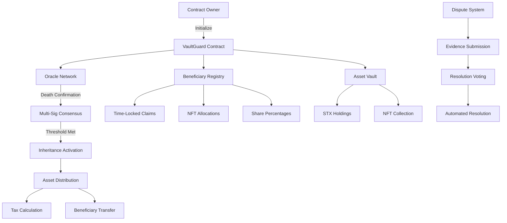
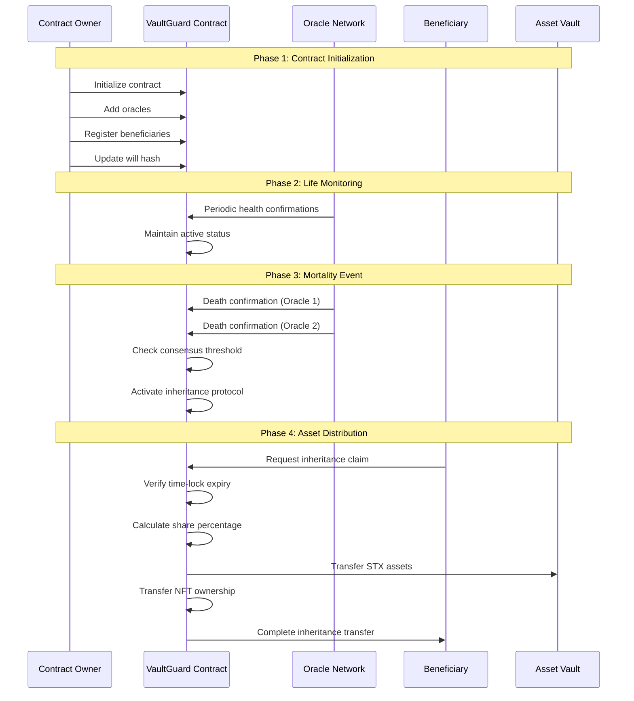

# VaultGuard Legacy Protocol (VGLP)

[](https://stacks.co)
[](https://bitcoin.org)
[](LICENSE)
[](package.json)

## Overview

VaultGuard Legacy Protocol (VGLP) is a revolutionary decentralized wealth succession framework built on Bitcoin's immutable foundation through Stacks Layer 2. It transforms traditional estate planning through blockchain innovation, offering cryptographic proof-of-life verification, time-release mechanisms, and transparent wealth transfer while maintaining privacy through cryptographic hashing.

### Key Features

- **🔐 Cryptographic Proof-of-Life**: Distributed oracle consensus for mortality verification
- **⏰ Time-Release Mechanisms**: Granular control over asset distribution timing
- **🎨 Digital Collectible Inheritance**: Native NFT transfer with provable ownership
- **⚖️ Multi-Stakeholder Arbitration**: Transparent dispute resolution pathways
- **📈 Progressive Asset Unlocking**: Minimizes inheritance shock, maximizes wealth preservation
- **🛡️ Bitcoin-Level Security**: Full regulatory compliance through Bitcoin's proven architecture

## System Overview



## Contract Architecture

### Core Components

#### 1. **State Management Layer**

```clarity
;; Primary state variables
- contract-owner: Principal authority
- oracles: Distributed verification network
- beneficiaries: Inheritance allocation mapping
- nft-ownership: Digital asset tracking
- disputes: Conflict resolution system
```

#### 2. **Oracle Verification System**

- **Multi-signature consensus** for mortality confirmation
- **Threshold-based activation** (configurable confirmation requirements)
- **Decentralized verification** to prevent single points of failure

#### 3. **Asset Management Engine**

- **Time-locked distributions** with block-height triggers
- **Percentage-based allocations** with automatic calculation
- **NFT inheritance** with provable ownership transfer
- **Progressive taxation** system (2% maintenance fee)

#### 4. **Dispute Resolution Framework**

- **Evidence-based submissions** with cryptographic hashing
- **Community-driven resolution** through voting mechanisms
- **Automated conflict resolution** with transparent outcomes

### Data Flow Architecture



## Technical Specifications

### Smart Contract Functions

#### Administrative Functions

- `initialize-contract`: Set up oracle network
- `add-beneficiary`: Register inheritance recipients
- `update-will-hash`: Cryptographic document verification
- `deactivate-contract`: Emergency shutdown protocol

#### Oracle Functions

- `confirm-death`: Multi-signature mortality verification
- `update-required-confirmations`: Adjust consensus threshold

#### Inheritance Functions

- `claim-inheritance`: Execute asset distribution
- `claim-phase-1`: Progressive release mechanism
- `raise-dispute`: Conflict resolution initiation

#### Query Functions

- `get-beneficiary-info`: Retrieve inheritance details
- `get-contract-status`: System operational status
- `get-nft-owner`: Digital asset ownership verification

### Security Features

#### Multi-Layer Verification

- **Oracle consensus** prevents fraudulent death claims
- **Time-lock mechanisms** ensure proper distribution timing
- **Cryptographic hashing** maintains document integrity
- **Principal validation** prevents unauthorized access

#### Economic Security

- **Inheritance taxation** (2% maintenance fee)
- **Share percentage validation** prevents over-allocation
- **Asset balance verification** ensures sufficient funds
- **Gas optimization** minimizes transaction costs

## Deployment Requirements

### Prerequisites

- Stacks blockchain testnet/mainnet access
- Clarity smart contract deployment tools
- Oracle network integration
- NFT collection deployment (if applicable)

### Environment Setup

```bash
# Install Stacks CLI
npm install -g @stacks/cli

# Deploy contract
stx deploy_contract vaultguard-legacy-protocol contract.clar

# Initialize oracle network
stx call_contract_func initialize-contract [oracle-addresses]
```

### Configuration Parameters

- **Required Confirmations**: Minimum oracle consensus (default: 2)
- **Inheritance Tax**: Protocol maintenance fee (default: 2%)
- **Time-lock Periods**: Beneficiary-specific release timing
- **NFT Allocations**: Digital asset distribution mapping

## Use Cases

### Individual Estate Planning

- **High-net-worth individuals** seeking automated succession
- **Digital asset collectors** requiring NFT inheritance
- **International families** needing borderless wealth transfer
- **Privacy-conscious investors** maintaining anonymity

### Institutional Applications

- **Family offices** managing generational wealth
- **Corporate succession** planning for key stakeholders
- **Charitable organizations** with automated endowment distribution
- **Investment funds** with time-locked beneficiary structures

## Security Considerations

### Threat Mitigation

- **Oracle collusion** prevented through consensus requirements
- **Smart contract bugs** minimized through formal verification
- **Beneficiary disputes** resolved through transparent arbitration
- **Economic attacks** deterred through proper incentive alignment

### Best Practices

- Regular oracle network health monitoring
- Periodic beneficiary information updates
- Secure private key management for contract owners
- Regular security audits and code reviews

## Future Enhancements

### Planned Features

- **Cross-chain compatibility** for multi-blockchain assets
- **AI-powered oracle verification** through IoT integration
- **Privacy-preserving beneficiary selection** using zero-knowledge proofs
- **Dynamic asset allocation** based on market conditions

### Integration Roadmap

- **DeFi protocol integration** for yield-generating inheritance funds
- **Legal compliance modules** for jurisdiction-specific requirements
- **Mobile application** for beneficiary management
- **Analytics dashboard** for inheritance tracking

## Contributing

We welcome contributions to VaultGuard Legacy Protocol. Please see our [Contributing Guidelines](CONTRIBUTING.md) for details on our development process, coding standards, and submission procedures.

### Development Setup

```bash
git clone https://github.com/leo-willy/vault-guard.git
cd legacy-protocol
npm install
npm run test
```

## License

This project is licensed under the MIT License - see the [LICENSE](LICENSE) file for details.
